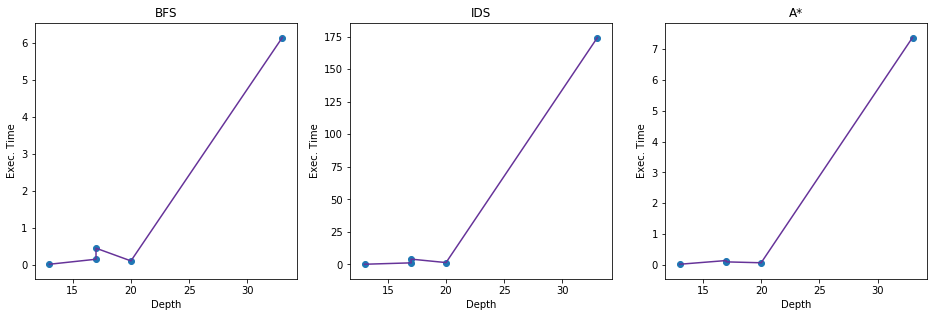

# PacMan
# CA1 - PacMan
## Yasaman Jafari - 810195376

In this project I am going to implement a version of Pacman without any ghosts and with two agents.


```python
import collections
import numpy as np
import time
from queue import PriorityQueue
import pandas as pd 
import matplotlib.pyplot as plt
%matplotlib inline
```

First, I read the game's map.


```python
file = open("./test cases/test5", "r") 
map_data = file.read()
print(map_data)
```

    %%%%%%
    %    %
    %    %
    %   P%
    %% %%%
    %  23%
    %1 1 %
    %%% %%
    %   Q%
    %%%%%% 


In this project, we have a map which consists of 2 agents which are shown with P and Q. There are foods in the map shown with 1, 2 and 3. 3 is edible for both P and Q. P can eat 1 and 2 is poison for it. Q can eat 2 and 1 is poison for it. 

### Model The Problem

We need to find the steps which leads to a map with no food.

We need to find the optimal way of doing this. We can model the problem and change it in order to make it a search problem. Then we can use search strategies to solve the problem.

To model the problem we need to have the components of a search problem which are the following parts:

- Initial State

- Actions

- Transition model

- Goal State

- Path Cost

In this problem we will have the followings as these components:

- Initial State: The map structure as read from the file

- Actions: Each agent can move UP, DOWN, RIGHT, and LEFT if its way is not blocked by walls, other agent or the poison for that agent

- Transition Model: If an agent goes from one place to another, it will be removed from the previous place and added to the new one in the map. If food exists in the new place, the agent will eat it and the food will no longer appear on the map. After each movement the state will be the new map with the changed mentioned.

- Goal State: The goal is to have a map free of food.

- Path Cost: The number of movements in order to reach the solution will be the path cost. (The depth of the solution in the search tree)

In order to keep the states and do the necessary actions on them, I have defined a class structure called Pacman. This class has the attributes below:

- map_data: The string of map (same format with the one read from the input file.)

- q_position and p_position: The positions of agents in the map are stored in the class. These positions are only found the first time an object from this class is instantiated. The next time the p_position and q_position is calculated based on the last state and the action. This way we do not search for them each time and we can save some time.

- food: Food is the count of food left in the map. Just like agents' positions, this attribute is only calculated once and then calculated based on the previous state and action. (It only gets updated and not calculated from scratch)

- eaten and all_food_pos: Eaten shows if a food was eaten in previous step. all_food_pos shows the position of all foods in the previous state. These are only used for A* algorithm to update the food positions. Otherwise food attribute will be sufficient. all_food_pos is only calculated the first time and when some food is eaten in the previous step. If food is eaten in previous state,  the positions for foods will be updated.

This is actually the state in our problem and each node keeps an state inside it. The actions needed for the states are implemented as methods of the class.


```python
class Pacman:
    
    def __init__(self, map_data, p_position=[], q_position=[], food=-1, eaten=False, all_food_pos=[]):
        self.moves = ["U", "R", "D", "L"]
        self.element_per_line = len(map_data.splitlines()[0]) + 1
        self.all_food_pos = all_food_pos
        self.eaten = eaten
        self.map = map_data
        self.all_food = food
        if food == -1:
            self.all_food = map_data.count("1") + map_data.count("2") + map_data.count("3")
        self.p_position, self.q_position = p_position, q_position
        if len(p_position) == 0 or len(q_position) == 0:
            self.p_position, self.q_position = self.get_agents_position()
        
    def get_position_in_map(self, pos):
        return([int((pos - (pos % self.element_per_line))/self.element_per_line),
               (pos % self.element_per_line)])
    
    def get_position_of_foods(self):
        if (self.all_food_pos == [] and self.all_food != 0) or self.eaten == True:
            self.eaten = False
            self.all_food_pos = [i for i, letter in enumerate(self.map) if letter in ["1", "2", "3"]]
            return self.all_food_pos
        return self.all_food_pos
        
    def get_1_dimension_position(self, x, y):
        return x * self.element_per_line + y
        
    def get_agents_position(self):
        q_position = self.get_position_in_map(self.map.find("Q"))
        p_position = self.get_position_in_map(self.map.find("P"))
        return p_position, q_position  
    
    def get_poison(self, agent_name):
        return "1" if agent_name == "Q" else "2"
    
    def get_other_agent(self, agent_name):
        return "P" if agent_name == "Q" else "Q"
    
    def check_directions(self, agent_name):
        poison = self.get_poison(agent_name)
        other = self.get_other_agent(agent_name)
        position = self.q_position if agent_name == "Q" else self.p_position
        x, y = position[0], position[1]
        up_right_down_left_x = [x-1, x, x+1, x]
        up_right_down_left_y = [y, y+1, y, y-1]
        return list(map(lambda x, y:not(self.map[self.get_1_dimension_position(x, y)] in ['%', poison, other]), up_right_down_left_x, up_right_down_left_y))
        
    def get_map_after_movements(self, direction, agent):
        poison = self.get_poison(agent)
        other = self.get_other_agent(agent)
        state = self.map
        pos = self.q_position if agent == "Q" else self.p_position
        x, y = pos[0], pos[1]
        new_pos = [x-1, y] if direction == "U" else [x, y+1] if direction == "R" else [x+1, y] if direction == "D" else [x, y-1]
        pos_1d = self.get_1_dimension_position(new_pos[0], new_pos[1])
        if self.map[pos_1d] in ['%', poison, other]:
            return
        new_q_position = [new_pos[0], new_pos[1]] if agent == "Q" else self.q_position
        new_p_position = [new_pos[0], new_pos[1]] if agent == "P" else self.p_position
        new_pos = self.get_1_dimension_position(new_pos[0], new_pos[1])
        state = state.replace(agent, " ")
        new_all_food = self.all_food
        eaten = False
        if state[new_pos] in ["1", "2", "3"]:
            new_all_food = self.all_food - 1
            eaten = True
        state = state[:new_pos] + agent + state[new_pos + 1:]
        return state, new_p_position, new_q_position, new_all_food, eaten, self.all_food_pos
    
    def get_maps_for_all_possible_moves(self):
        q_moves = self.check_directions("Q")
        p_moves = self.check_directions("P")
        q_maps = [self.get_map_after_movements(self.moves[i], "Q") for i in np.where(q_moves)[0].tolist()]
        p_maps = [self.get_map_after_movements(self.moves[i], "P") for i in np.where(p_moves)[0].tolist()]
        return q_maps + p_maps
```


```python
pacman_board = Pacman(map_data)
```

Now we create a node class for each node of the search graph. This class has the map state and its parent.Level shows the depth of the current state of the node. Parent is set as default value of -1 now but can be given to the constructor of the node if needed. By having the parent node, we can trace the solution and view the steps which lead to the current state.


```python
class Node:
    
    def __init__(self, state, level, parent=-1):
        self.state = state
        self.level = level
        self.parent = parent
        
    def __gt__(self, other):
        return self.heuristic > other.heuristic
        
    def set_heuristic(self, heuristic):
        self.heuristic = heuristic
      
```

## Search Algorithms

I will implement the search algorithms listed below in this project and explain their pros and cons later:

- BFS (Breadth First Search)

- IDS (Iterative Deepening Search)

- A*

### BFS

BFS or Breadth First Search is a search algorithm which will give us the optimal solution.

In BFS, we traverse the tree by expanding the nodes in the closest depth and going to the next depth after visiting all the nodes in the current level. 

As the nodes are explored based on their depth, it is guarantied that the solution (if found) is optimal. In other words, we go forward according to the depth so if solutions exist in different levels, it will definately find the one with lower depth first.

To implement BFS, I have chosen the initial state(read from input file) as the root and its level is considered 0.

In each step, I pop a node from the frontier FIFO queue. Frontier consists of the nodes which are not yet expanded themselves (but their parent is expanded.) Frontier is a FIFO queue because in BFS we choose nodes in FIFO manner.

I also have a set called explored. I have chosen the set data structure for it as we can lookup a value in set with time complexity of O(1). 

After expanding each node, I create the child nodes with a level(depth) of their parent plus one. I check each child node to see if they are the goal state ot not. If the state of a child node is goal, I return it. If it is not, we need to check if it is in frontier or explored. If it is not, we add it to the frontier set. As explored set in only there for this cause, I decided to also add the frontier states to the explored(as well as keeping a separate FIFO queue for it) in order to save time on checking the existance of new child node in these lists. (We will have a set containing both explored and frontier states to check if we need to add the node to frontier.) This is exactly same as checking them separately.


```python
def bfs(initial_state):
    nodes_count = 1
    root = Node(initial_state, 0)
    if root.state.all_food == 0:
        return root
    frontier = collections.deque([root])
    explored = set([root.state.map])
    while True:
        if len(frontier) == 0:
            return "FAIL", -1, -1
        node = frontier.popleft()
        states = node.state.get_maps_for_all_possible_moves()
        for state, p_pos, q_pos, food, eaten, all_food_pos in states:
            child = Node(Pacman(state, p_pos, q_pos, food), node.level + 1)
            if not child.state.map in explored:
                nodes_count += 1
                if child.state.all_food == 0:
                    return child, nodes_count, nodes_count
                frontier.append(child)
                explored.add(child.state.map)
```

Now, I run the BFS algorithm and measure the time it takes to complete the search and also find the number of nodes visited in order to find the solution. In order to find the node count, I added a counter to BFS function.


```python
start_time = time.time()

node, nodes_count, distint_nodes_count = bfs(pacman_board)

print("--- %s seconds ---" % (time.time() - start_time))

print("Solution's Depth: ", node.level)
print("Nodes Visited: ", nodes_count)
print("Distinct Nodes Visited: ", distint_nodes_count)
```

    --- 0.010934114456176758 seconds ---
    Solution's Depth:  13
    Nodes Visited:  308
    Distinct Nodes Visited:  308


### IDS

IDS or Iterative Deepening Search is a depth-limit version of DFS (Depth First Search). In IDS we start with level (depth) of zero and increase it in every iteration. In the depth of i, we run DFS with maximum depth of i. We repeatedly increase the depth limit until a solution is found.

In order to implement the DFS algorithm which is called by IDS, I modified the BFS algorithm explained above. The modifications are listed below:

- The frontier list is implemented as stack (LIFO) instead of FIFO queue in BFS.

- In order to check if I need to add the child node to the frontier, it is not enough to check the state and the depth must also be checked. This is because the fact that we might reach the same state in different depths and we want the one with smaller depth in order to reach the optimal solution.

- A level limit is added to the algorithm. I only expand a node if its level is smaller that the level limit. Otherwise the child's depth will be larger that the limit. If node's level is not smaller than the limit level, I onlt pop it from the frontier stack and not expand it.

- We check if we have reached the goal after expansion only.


```python
def dfs_with_max_level(level, initial_state):
    nodes_count = 1
    nodes_distinct_count = 1
    node = Node(initial_state, 0)
    if node.state.all_food == 0:
        return node
    frontier = [node]
    explored = {}
    explored[node.state.map] = 0
    explored_state = set([node.state.map])
    first = True
    while True:
        if len(frontier) == 0:
            return "FAIL", nodes_count, nodes_distinct_count
        node = frontier.pop()
        if node.state.all_food == 0:
            return node, nodes_count, nodes_distinct_count
        if node.level >= level:
            continue
        states = node.state.get_maps_for_all_possible_moves()
        for state, p_pos, q_pos, food, eaten, all_food_pos in states:
            child = Node(Pacman(state, p_pos, q_pos, food), node.level + 1)
            if not child.state.map in explored or explored[child.state.map] > child.level:
                nodes_count += 1
                frontier.append(child)
                explored[child.state.map] = child.level
                if not child.state.map in explored_state:
                    explored_state.add(child.state.map)
                    nodes_distinct_count += 1
```

IDS algorithm starts with level 0 and calls DFS function with that. It will increase the level limit until a solution is found. If DFS finds a solution in some level, IDS will return its solution.


```python
def ids(initial_state):
    level = 0
    all_nodes_count = 0
    while True:
        result, nodes_count, nodes_distinct_count = dfs_with_max_level(level, initial_state)
        all_nodes_count += nodes_count
        if result != "FAIL":
            break
        level += 1
    return result, all_nodes_count, nodes_distinct_count
```

Now, I run the IDS algorithm and measure the time it takes to complete the search and also find the number of nodes visited in order to find the solution.


```python
start_time = time.time()

node, all_nodes_count, nodes_count = ids(pacman_board)

print("--- %s seconds ---" % (time.time() - start_time))

print("Solution's Depth: ", node.level)
print("Nodes Visited: ", all_nodes_count)
print("Distinct Nodes Visited: ", nodes_count)
```

    --- 0.07356595993041992 seconds ---
    Solution's Depth:  13
    Nodes Visited:  2451
    Distinct Nodes Visited:  264


### A*

A* is an informed search algorithm. In A* we use a heuristic function as well as trying not to expand the paths which have already cost us a lot. 

Heuristic function h(n) estimates the cost of reaching goal from node n.

A* will give us the optimal solution if:

- The heuristic function is admissible - for tree search

- The heuristic function is consistent - for graph search

A* chooses the node with minimum value of f(n) = g(n) + h(n) in each step to expand. g(n) is the actual cost so far to reach node n and h(n) is the estmated cost to goal from node n.

#### Heuristic Function

For heuristic function, for each food in the map, I calculated its manhattan distance from each agent. Then I got the minimum of its distance from P and Q. This shows the minimum steps (depth) needed for that fruit to be eaten by either P and Q. In reality, it is probably much more than that as there may be obstacles in the way or the agents may choose to go in opposite directions, etc. This way I calculated the minimum steps required for each fruit to be eaten. Then I found the maximum of these values. This value is the minimum steps needed for the fruit which is furthest from both agents to be eaten. In the goal state, this fruit must be eaten for sure and the minimum steps needed for it to be eaten is the value explained above. 

According to the explanaitions above, this value is admissible because it is not more than the actual value to the goal. Even when only one food exists in the map, this value will be admissible as explained above.

This heuristic function is also consistent because for each h(a) and h(b) the actual cost from a to b will always be greater or equal to h(a) - h(b) as the actual cost from a to b if no obstacles exist is the manhattan distance between a and b (and if there are obstacles it will be more). If there are no obstacles and b is in the way of a to goal, the actual distance from a to b will be h(a) - h(b) but as explained in the more realistic cases above, this value is likely to be much larger.


```python
def get_heuristic(state):
    if state.all_food == 0:
        return 0
    all_food_pos = state.get_position_of_foods()
    max_dist = 0
    for food in all_food_pos:
        food_pos = state.get_position_in_map(food)
        x, y = food_pos[0], food_pos[1]
        dist_from_p = abs(state.p_position[0] - x) + abs(state.p_position[1] - y)
        dist_from_q = abs(state.q_position[0] - x) + abs(state.q_position[1] - y)
        max_from_agent = min(dist_from_p, dist_from_q)
        if max_dist < max_from_agent:
            max_dist = max_from_agent
    return max_dist
```

In order to implement A*, we modify the BFS algorithm. The modifications are listed below:

- Frontier is implemented as a PriorityQueue. PriorityQueue is actually a heap which keeps the values inside it based on their priority. This way, when we want to pop a node from frontier, the node with smallest value for f(n) will be popped. In frontier, I keep the node objects and in order to handle the comparison for adding/getting a value from heap, I overrided the __gt__ (greater) implementation of node class.

- f(n) is computed for each node when created and added to it as an attribute.

- We check if a node is goal after expansion of that node and not when it is created.

- If we reach a state with lower depth again, we replace the previous one with the one with lower depth.


```python
def a_star(initial_state):
    dup_node_count = 0
    distinct_node_count = 1
    root = Node(initial_state, 0)
    if root.state.all_food == 0:
        return root, -1, distinct_node_count
    frontier = PriorityQueue()
    priority_num = get_heuristic(root.state) + root.level
    root.set_heuristic(priority_num)
    frontier.put(root)
    explored = set()
    frontier_state = {}
    frontier_state[root.state.map] = root.level
    while True:
        if frontier.empty():
            return "FAIL", -1, distinct_node_count
        node = (frontier.get())
        if node.state.all_food == 0:
            return node, distinct_node_count + dup_node_count, distinct_node_count
        states = node.state.get_maps_for_all_possible_moves()
        for state, p_pos, q_pos, food, eaten, all_food_pos in states:
            child = Node(Pacman(state, p_pos, q_pos, food, eaten, all_food_pos), node.level + 1)
            priority_num = get_heuristic(child.state) + child.level
            child.set_heuristic(priority_num)
            if not child.state.map in explored:
                distinct_node_count += 1
                frontier.put(child)
                explored.add(child.state.map)
            elif child.state.map in frontier_state and frontier_state[child.state.map] > child.level:
                dup_node_count += 1
                frontier_state[child.state.map] = child.level
                frontier.put(child)
```

Now, I run the A* algorithm and measure the time it takes to complete the search and also find the number of nodes visited in order to find the solution.


```python
start_time = time.time()

node, all_nodes_count, distinct_node_count = a_star(pacman_board)

print("--- %s seconds ---" % (time.time() - start_time))

print("Solution's Depth: ", node.level)
print("Nodes Visited: ", all_nodes_count)
print("Distinct Nodes Visited: ", distinct_node_count)
```

    --- 0.016764163970947266 seconds ---
    Solution's Depth:  13
    Nodes Visited:  271
    Distinct Nodes Visited:  271


As it is shown above, the states visited are less than BFS but the execution time is more. This is becuase of the calculations done for the heuristic of each node which take some more time for each node.

## Comparison of the Search Algorithms

### BFS:

- Complete? Yes (If branching factor is finite.)

- Optimal? Yes (If cost of the edges are equal.)

- Time? O($b^d$) where b is the branching factor and d is the solution's depth.

- Space? O($b^d$)

### IDS:

- Complete? Yes (If branching factor is finite.)

- Optimal? Yes (If cost of the edges are equal.)

- Time? (d+1)$b^0$ + (d)$b^1$ + (d-1)$b^2$ + ... + $b^d$ = O($b^d$)

- Space? O(bd)

### A*:

- Complete? Yes 

- Optimal? Yes 

- Time? Number of nodes for which f(n) ≤ C* where C* is the optimal path cost (exponential)
    It actually depends on the heuristic and it reduces when the heuristic gets closer to the actual cost. 

- Space? Space is also exponential and it depends on the heuristic and how close it is to the actual cost.

## Algorithms' Exectutions with Details


```python
def get_mean_exec_and_state_count(count, algorithm, test):
    file = open("./test cases/" + test, "r") 
    map_data = file.read()
    board = Pacman(map_data)
    sum_time = 0
    for i in range(count):        
        start_time = time.time()

        node, all_nodes_count, distinct_count = algorithm(board)

        sum_time += (time.time() - start_time)
    return (sum_time / count), all_nodes_count, distinct_count, node.level
```

Below, there is a table which shows the details of each algorithm on each test case.


```python
time_bfs_1, all_node_bfs_1, distinct_bfs_1, level_bfs_1 = get_mean_exec_and_state_count(3, bfs, "test1")
time_bfs_2, all_node_bfs_2, distinct_bfs_2, level_bfs_2 = get_mean_exec_and_state_count(3, bfs, "test2")
time_bfs_3, all_node_bfs_3, distinct_bfs_3, level_bfs_3 = get_mean_exec_and_state_count(3, bfs, "test3")
time_bfs_4, all_node_bfs_4, distinct_bfs_4, level_bfs_4 = get_mean_exec_and_state_count(3, bfs, "test4")
time_bfs_5, all_node_bfs_5, distinct_bfs_5, level_bfs_5 = get_mean_exec_and_state_count(3, bfs, "test5")
time_ids_1, all_node_ids_1, distinct_ids_1, level_ids_1 = get_mean_exec_and_state_count(3, ids, "test1")
time_ids_2, all_node_ids_2, distinct_ids_2, level_ids_2 = get_mean_exec_and_state_count(3, ids, "test2")
time_ids_3, all_node_ids_3, distinct_ids_3, level_ids_3 = get_mean_exec_and_state_count(3, ids, "test3")
time_ids_4, all_node_ids_4, distinct_ids_4, level_ids_4 = get_mean_exec_and_state_count(3, ids, "test4")
time_ids_5, all_node_ids_5, distinct_ids_5, level_ids_5 = get_mean_exec_and_state_count(3, ids, "test5")
time_a_star_1, all_node_a_star_1, distinct_a_star_1, level_a_star_1 = get_mean_exec_and_state_count(3, a_star, "test1")
time_a_star_2, all_node_a_star_2, distinct_a_star_2, level_a_star_2 = get_mean_exec_and_state_count(3, a_star, "test2")
time_a_star_3, all_node_a_star_3, distinct_a_star_3, level_a_star_3 = get_mean_exec_and_state_count(3, a_star, "test3")
time_a_star_4, all_node_a_star_4, distinct_a_star_4, level_a_star_4 = get_mean_exec_and_state_count(3, a_star, "test4")
time_a_star_5, all_node_a_star_5, distinct_a_star_5, level_a_star_5 = get_mean_exec_and_state_count(3, a_star, "test5")
```


```python
data = {'Solution Depth':[level_bfs_1, level_bfs_2, level_bfs_3, level_bfs_4, level_bfs_5, 
                          level_ids_1, level_ids_2, level_ids_3, level_ids_4, level_ids_5,
                          level_a_star_1, level_a_star_2, level_a_star_3, level_a_star_4, level_a_star_5], 
        'Distinct States Viewed':[distinct_bfs_1, distinct_bfs_2, distinct_bfs_3, distinct_bfs_4, distinct_bfs_5,
                                 distinct_ids_1, distinct_ids_2, distinct_ids_3, distinct_ids_4, distinct_ids_5, 
                                 distinct_a_star_1, distinct_a_star_2, distinct_a_star_3, distinct_a_star_4, distinct_a_star_5],
        'All States Viewed': [all_node_bfs_1, all_node_bfs_2, all_node_bfs_3, all_node_bfs_4, all_node_bfs_5,
                              all_node_ids_1, all_node_ids_2, all_node_ids_3, all_node_ids_4, all_node_ids_5,
                              all_node_a_star_1, all_node_a_star_2, all_node_a_star_3, all_node_a_star_4, all_node_a_star_5],
        'Exec. Time (sec)': [time_bfs_1, time_bfs_2, time_bfs_3, time_bfs_4, time_bfs_5,
                              time_ids_1, time_ids_2, time_ids_3, time_ids_4, time_ids_5,
                              time_a_star_1, time_a_star_2, time_a_star_3, time_a_star_4, time_a_star_5]} 
  
df = pd.DataFrame(data, index =['BFS - Test1', 'BFS - Test2', 'BFS - Test3', 'BFS - Test4', 'BFS - Test5', 'IDS - Test1', 'IDS - Test2', 'IDS - Test3', 'IDS - Test4', 'IDS - Test5', 'A* - Test1', 'A* - Test2', 'A* - Test3', 'A* - Test4', 'A* - Test5'])  
  
df
```


<div>
<style scoped>
    .dataframe tbody tr th:only-of-type {
        vertical-align: middle;
    }

    .dataframe tbody tr th {
        vertical-align: top;
    }

    .dataframe thead th {
        text-align: right;
    }
</style>
<table border="1" class="dataframe">
  <thead>
    <tr style="text-align: right;">
      <th></th>
      <th>Solution Depth</th>
      <th>Distinct States Viewed</th>
      <th>All States Viewed</th>
      <th>Exec. Time (sec)</th>
    </tr>
  </thead>
  <tbody>
    <tr>
      <th>BFS - Test1</th>
      <td>33</td>
      <td>148557</td>
      <td>148557</td>
      <td>6.155249</td>
    </tr>
    <tr>
      <th>BFS - Test2</th>
      <td>17</td>
      <td>3706</td>
      <td>3706</td>
      <td>0.143780</td>
    </tr>
    <tr>
      <th>BFS - Test3</th>
      <td>20</td>
      <td>2672</td>
      <td>2672</td>
      <td>0.098720</td>
    </tr>
    <tr>
      <th>BFS - Test4</th>
      <td>17</td>
      <td>10744</td>
      <td>10744</td>
      <td>0.443167</td>
    </tr>
    <tr>
      <th>BFS - Test5</th>
      <td>13</td>
      <td>308</td>
      <td>308</td>
      <td>0.007908</td>
    </tr>
    <tr>
      <th>IDS - Test1</th>
      <td>33</td>
      <td>142137</td>
      <td>4802015</td>
      <td>174.376395</td>
    </tr>
    <tr>
      <th>IDS - Test2</th>
      <td>17</td>
      <td>3370</td>
      <td>37162</td>
      <td>1.144594</td>
    </tr>
    <tr>
      <th>IDS - Test3</th>
      <td>20</td>
      <td>2598</td>
      <td>45496</td>
      <td>1.352961</td>
    </tr>
    <tr>
      <th>IDS - Test4</th>
      <td>17</td>
      <td>10938</td>
      <td>98737</td>
      <td>4.004460</td>
    </tr>
    <tr>
      <th>IDS - Test5</th>
      <td>13</td>
      <td>264</td>
      <td>2451</td>
      <td>0.073286</td>
    </tr>
    <tr>
      <th>A* - Test1</th>
      <td>33</td>
      <td>84842</td>
      <td>84842</td>
      <td>7.376521</td>
    </tr>
    <tr>
      <th>A* - Test2</th>
      <td>17</td>
      <td>2025</td>
      <td>2025</td>
      <td>0.133705</td>
    </tr>
    <tr>
      <th>A* - Test3</th>
      <td>20</td>
      <td>968</td>
      <td>968</td>
      <td>0.061281</td>
    </tr>
    <tr>
      <th>A* - Test4</th>
      <td>17</td>
      <td>1585</td>
      <td>1585</td>
      <td>0.090620</td>
    </tr>
    <tr>
      <th>A* - Test5</th>
      <td>13</td>
      <td>271</td>
      <td>271</td>
      <td>0.013446</td>
    </tr>
  </tbody>
</table>
</div>


## Execution Time and Solution Depth Plots


```python
plt.rcParams["figure.figsize"][0] = 16
plt.rcParams["figure.figsize"][1] = 16
```


```python
for i in range(3):
    data_for_alg = (df[i*5:i*5+5]).sort_values(by='Solution Depth', axis=0, ascending=True, inplace=False, kind='quicksort', na_position='last')
    plt.subplot(3, 3, i+1, xlabel='Depth', ylabel='Exec. Time')
    plt.plot(data_for_alg['Solution Depth'], data_for_alg['Exec. Time (sec)'], 'rebeccapurple')
    plt.scatter(data_for_alg['Solution Depth'], data_for_alg['Exec. Time (sec)'])
    title = 'BFS' if i == 0 else 'IDS' if i == 1 else 'A*'
    plt.title(title)
```




